本文以 $ImageNet$ 比赛为主要索引，以时间顺序详细介绍 $CNN$ 如何一步步发展的。时间线主要以相对顺序为主，不一定特别精确，感兴趣的读者可以根据文章结尾的引用阅读原论文，如有错误，欢迎评论指正。

<!-- ======= -->

$1998$ 年，$CNN$ “三大鼻祖”之一的 $LeNet$ 发表，只是由于硬件的限制，这篇论文在当时并没有引起很大的关注，直到现在深度学习风生水起，这篇文章也重新被挖出来。

粗略地看一眼论文，除了卷积操作外，我们还会看到梯度下降、反向传播等现在深度学习以及卷积神经网络中很多耳熟能详的东西。

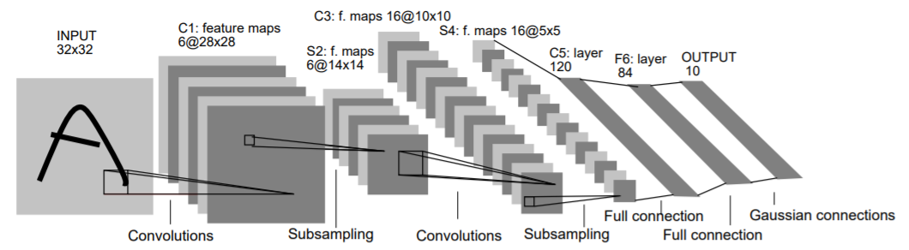
LeNet 网络架构

如图所示，作者提出的网络架构可以简化为：$(Conv - Subsampling) - Fully$ $Connection$ ，其中 $Subsampling$ 可以认为是现代网络中 $Pooling$ 的雏形。

$LeNet$ 的贡献点主要有2个：其一，它模拟人脑思维，提出卷积层，并且整体从 $Low$ $Level$ 到 $High$ $Level$过渡 ，前期通过卷积操作获取图像的 $local$ 信息，后期进行整合；其二，通过卷积操作，大大减少了参数数量，我们知道，如果使用全连接网络，那它的参数会非常多（比如 $1024^2$ ），而使用卷积后参数数量则是 $w^2$ （其中 $w$ 为卷积核大小）。

> 如果我们有一个 $table$ 类型的数据（比如所有学生各科的成绩数据），我们想用它做一些预测任务，这时可以用 $CNN$ 吗？答案是不能，因为 $table$ 数据没有位置或顺序信息，即没有 $local$ 信息，因此不能使用 $CNN$ 。

$2012$ 年，$AlexNet$ 在 $ImageNet$ 比赛上取得冠军，它其实并没有一个专门的名称，由于人们习惯于将 $CNN$ 作为整个网络家族的称呼，因此以作者 $Alex$ 的名字命名这个模型。

$AlexNet$ 汲取前人经验，使用 $Pooling$ 代替了 $Subsampling$ ，并且网络更深。它也是第一个用 $GPU$ 完成训练的模型，在当时的硬件环境下，只能将模型拆成两半放到两张卡上训练，这也是为什么图中的模型会分成上下两块。

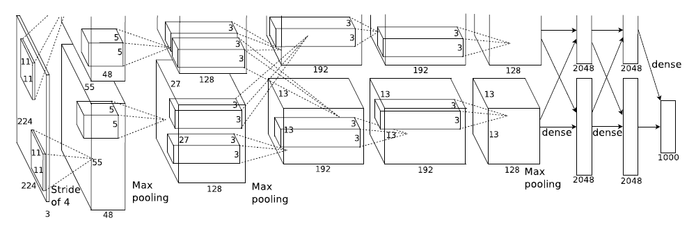
AlexNet 网络架构

此外，我们可以看到 $CNN$ 的模型套路基本成型：$(Conv - Pooling) * k - Dense$ ，这个套路的简单且容易复制，之后的网络基本都是在此基础上不断挖掘创新。

$2013$ 年，沿用着前人总结的套路，$ImageNet$ 的记录继续被 $CNN$ 刷新。不过这一年的亮点并不在于模型本身和它的效果，而是夺冠者在他们的论文里加入了可视化的工作。

我们都知道神经网络虽然效果很好，但它有一个致命缺点：它是一个黑匣子，我们不知道它内部究竟是怎样做出决策的，也不知道它背后的原理。

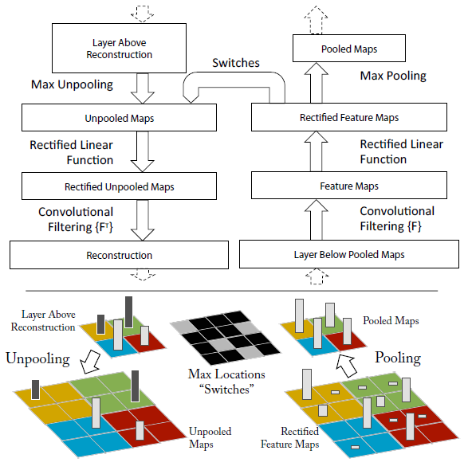
Unpooling

论文中的 $Visualize$ 工作采用了 $Unpooling$ 的思想，研究一幅图像中哪些地方是网络注意到的。

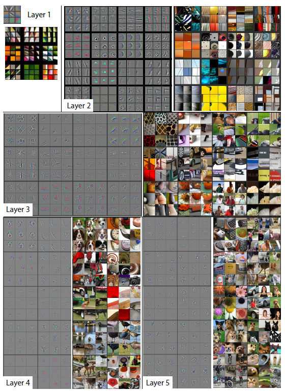
可视化

根据论文中的可视化图像，我们发现低层次的网络对于边边角角极为敏感，越到上层，网络所关注的东西越抽象，越体现出网络对整体的判断。

$2014$ 年，$VGG$ 诞生。从网络架构中可以看出它将套路走到了极致。

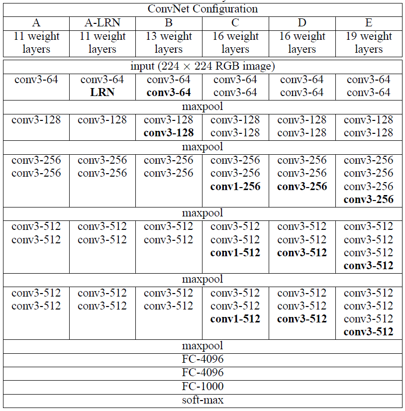
VGG 网络架构

它还提出了多个 $3 * 3$ 的卷积核结合可模拟任何尺寸（不算 $1 * 1$ ）卷积核的思想，在模型中几乎全是 $3 * 3$ 的卷积。

此外，为了起到一个 $balance$ 的效果，模型每次都将 $channel$ 有规律地放大为原来的 $2$ 倍。

$VGG$ 网络的层数已经可以达到上千层，这里的层并非指 $(Conv - Pooling) * k - Dense$ 中的 $k$。倘若网络中有 $n$ 个 $Conv$ ，可以设计多个 $Conv$ 再 $Pooling$ ，自然可以通过叠加卷积层达到上千层。

> 卷积是一种线性运算，多个线性运算的叠加等同于一次线性运算，为什么这里多个卷积层叠加仍然算是增加了层数？因为神经网络的设计，每一层的输出都要经过一个非线性操作，因此每个卷积层的最后还有非线性操作，多个卷积层的叠加并不是多个线性运算，反而增加了非线性。

事实上，训练一个上千层的神经网络可能是完全没必要的，因为 $1000$ 层和 $100$ 层的网络效果可能并没有多大差别，而更深层的网络还面临梯度消失的风险，这在之后的 $GoogLeNet$ 可以看出它为了避免梯度消失做了多少工作。

$2015$ 年，$Google$ 发布了 $GoogLeNet$ ，它故意将字母 $l$ 大写以凑成 $LeNet$ ，可能也是一种致敬。

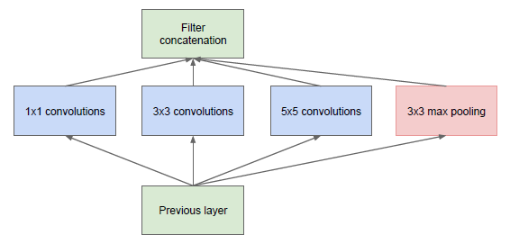
inception

论文中主要提出了一种 $Inception$ 的网络结构并做出了以下改进：

GoogLeNet 网络架构

其一，它不再关注网络深度（ $depth$ ），而是在宽度（ $width$ ）上做文章，如果我们把一个个方块计为网络层数，那这个数字也不小。

其二，我们讨论过卷积核大小带来的影响，对我们而言，可能并不确定哪种尺寸的卷积核是最好的，$Inception$ 索性全都用上，再做一个 $concat$ ，由网络自行选择。

其三，我们可以看到网络里不只有一个输出层，而是有三个输出层，事实上网络层数有 $100$ 多层，如果仅靠一个输出层，因为梯度的问题训练网络将会十分困难，设计成三个输出层可以依次训练三个 $loss$ 相加，保证了梯度不会消失，代价是增加了训练成本。

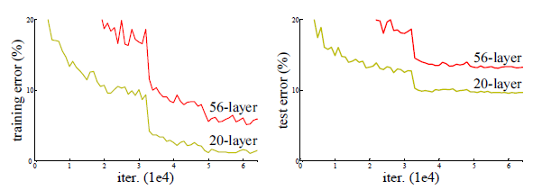

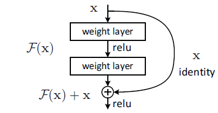

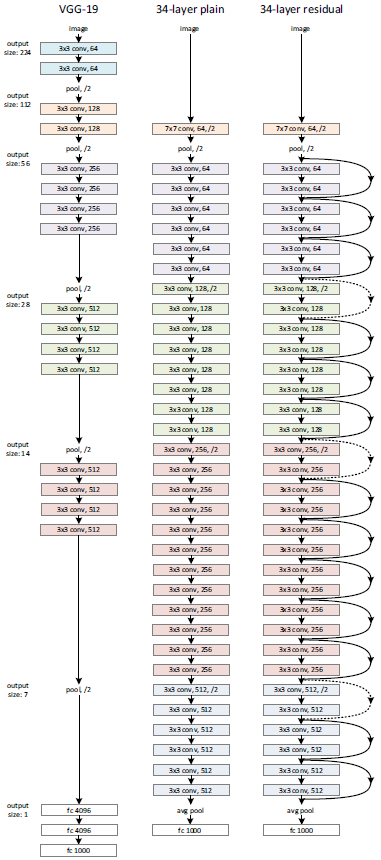

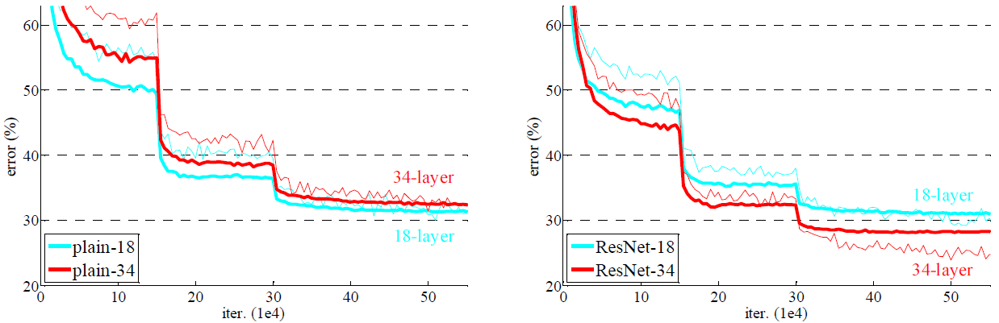

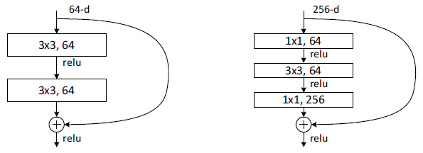

$2016$ 年，差不多是半年后，$Microsoft$ 研究的 $ResNet$ 问世。

了解的人应该知道，它其实并没有想象中的那么复杂，仅仅是多了个 $skip$ $connection$ ，便解决了梯度消失的问题，使得深层次网络更容易训练。由于残差结构的可拓展性或者说可复制性非常好，残差网络的影响力远大于同一时期 $Google$ 的 $GoogLeNet$。

> 某种程度上讲，$GoogLeNet$ 的网络结构过于复杂了，远没有 $ResNet$ 的结构简单，这也是为什么现在 $ResNet$ 名声在外，而 $GoogLeNet$ 一直“默默无闻”的一个重要原因。这在某种程度上也是一种启示。

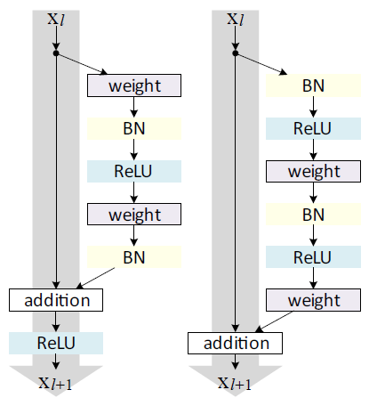

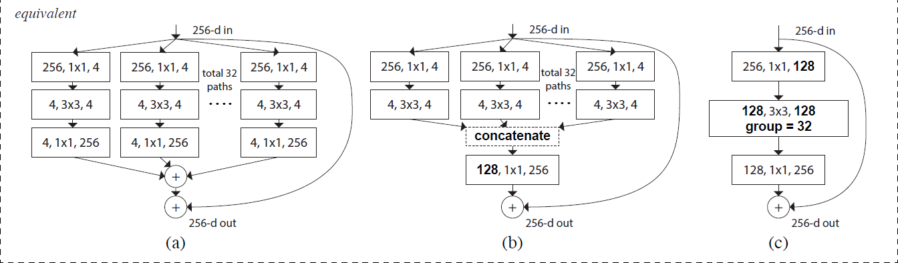

没过多久，发表 $ResNet$ 的第一作者何凯明对原有的 $ResNet$ 做了改进并又发了一篇文章，我们暂且称之为 $ResNet-v2$ ，它也是第一个达到上千层的网络。理论上说这一次才算是“成熟体”的 $ResNet$ ，其知名度却远远不如第一代。通过对比两个网络细微的差别，经过改进之后的 $ResNet$ 网络结构更加有规律，可以将其总结为：$X_{l+1}=X_l+f(X_l)$ ，感兴趣的读者可以自行搜索 $pre$ $norm$ 和 $post$ $norm$ 的差别。

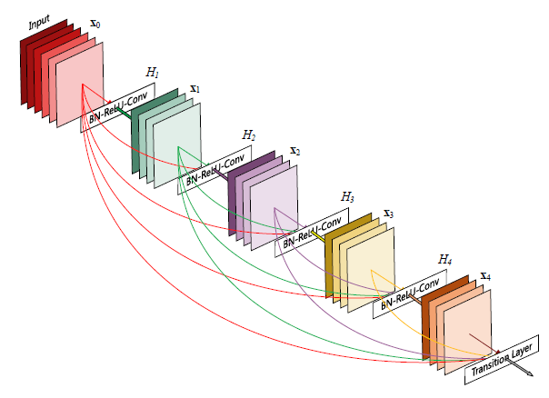

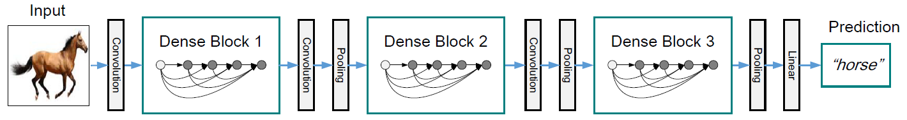

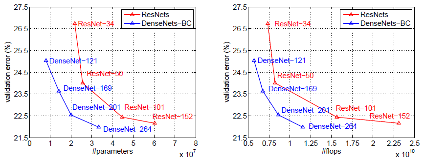

$2018$ 年，$DenseNet$ 发表，作者是姚班的一名本科生，当时读 $ResNet$ 论文，心中不解为何 $skip$ $connection$ 必须隔两层一跳，于是设计了 $dense$ $block$ ，在此模块里 $skip$ $connection$ 可以任意跳（仅此一点设计，便拿到当时的 $best$ $paper$ ）。不过也只有在 $dense$ $block$ 里才能随意链接，不然给一个 $1000$ 层的网络，链接数可太多了，此外模型还面临着多层信息如何叠加的问题，后期应用其实不多。

> $Tips$：如果当时读 $ResNet$ 论文，你是否能想到这个问题？如果能想到，而且你的能力支持你能在3-6个月内产出一篇论文的话，$best$ $paper$ 就是你的了。

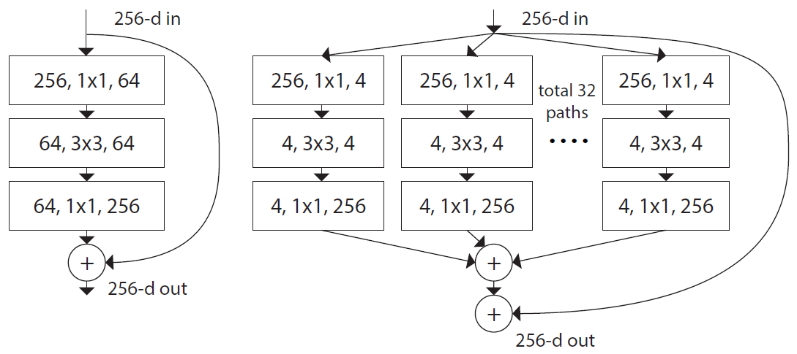

这之后，何凯明对 $ResNet$ 又有了新的想法，我们不妨称之为 $ResNet-v3$ 。新的网络主要将原本 $single$ 的残差结构变为 $multi-head$ ，我们等讲到 $Transformer$ 才会接触到这种结构，主要采用独立走多次然后合并的思想。

> $Tips$：论文中并没有直接道出最后的模型，而是从一个简单易懂的模型开始，逐步证明其 $equivalent$ ，这是一个写论文的重要启示。

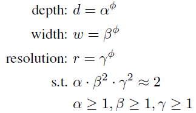

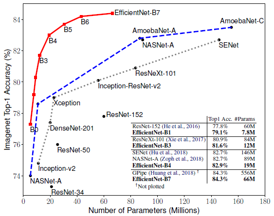

$2020$ 年，$EfficientNet$ 以 $depth$， $width$ 和 $resolution$ 为研究对象，想要更方便的得到一个比较优的网络模型参数。它的思想是，如果找到了 $\alpha$，$\beta$ 和 $\gamma$ 最优的小模型（如 $\alpha \cdot \beta^2 \cdot \gamma^2=2$ 解出这三个参数的解来，其中等式左边公式按照时间复杂度，因此有物理意义），等比例地 $upsacle$ 以下就能不用做更加复杂的实验，方便得到大模型的参数了。

到了现在，$ImageNet$ 早已经不办了，$CNN$ 领域在最近几年也没有很轰动一时的文章了，对相关领域感兴趣的可以自行查阅最近相关模型效果和排名。推荐最近的一篇论文，可以对 $timm$ $library$ 做一些了解。

至此已经将 $CNN$ 大概的说了一遍，介绍时使用散点形式，以时间线为 $trace$ ，并没有过多讲解每一个模型的具体原理和内容，主要放在其特点和闪光点上。通过一番整理，更容易理解和记忆，对于一些特定的任务也更方便考虑使用哪一种 $CNN$ 网络，并且在某种程度上预测了下一个模型。
