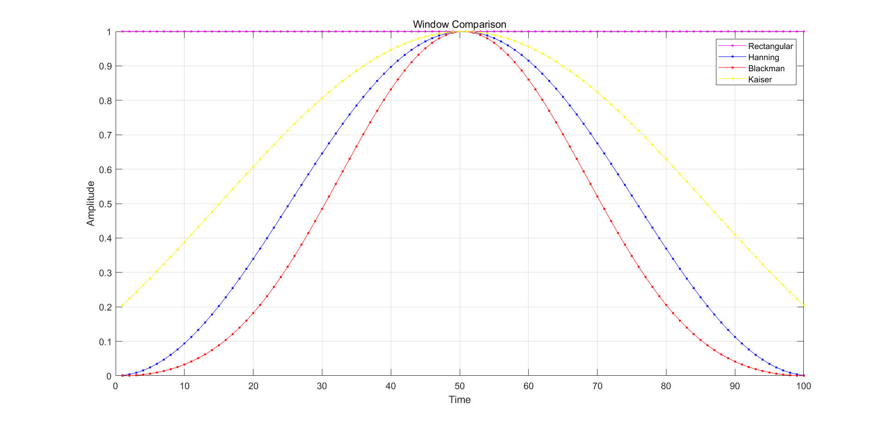
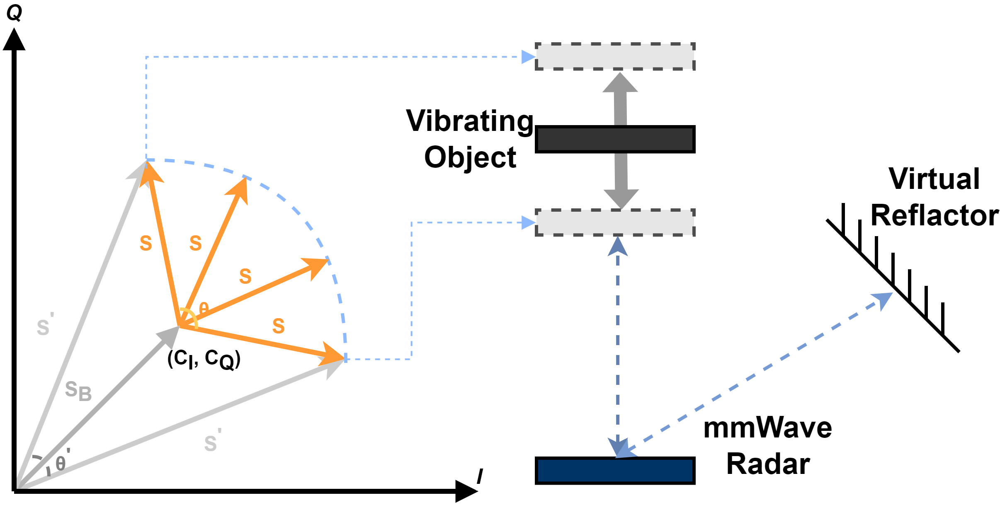

<!-- ======= -->
基于无线信号的语音恢复技术

近年来，随着智能手机的普及，语音助手在现代社会中扮演者越来越重要的角色，为人们的生产和生活提供了便捷。另一方面，在传达指令时经常会混入一些环境噪声，这对语音助手接收和理解指令造成了很大的困扰。

很多研究致力于提出各种算法来消除噪声以提升下游任务的效果。我们使用毫米波雷达来直接获取振动并恢复语音，在嘈杂的环境中通过提取目标的声带附近的振动信号，并基于一些算法消除噪声后获得的语音信号将十分接近原语音；基于相同原理，通过获取现代工业中机器的振动属性可以来判断机器是否正常工作。这种方法面临着一些挑战：首先，在嘈杂的环境中一般有多个音源或参杂着其他反射的声音信号，我们需要从众多的音源中确定目标物体；其次，提取目标物体的振动信息后，我们需要重建原来的语音信号。

我们通过搭建毫米波雷达的软硬件环境，基于调频连续波的特性，对信号进行快速傅里叶变换，从中提取中目标物体的距离，速度和角度信息，之后使用一种迭代方法恢复原始语音信号，以实现一种基于无线信号的低成本、较高分辨率的语音恢复技术。

# 绪论

## 选题背景和研究意义

由于使用起来简洁和便利的原因，语音助手在人们的日常生活中越来越普及，许多语音助手都需要接收到外部环境输入的语音信号进行后续识别处理，在安静的条件下可以达到不错的识别效果。然而，在环境嘈杂的情况下，语音助手可能会识别出错误的指令甚至无法识别出指令。此外，由于工厂机器设施本身特有的振动特性（振幅，频率等）的异常通常反映了其本身的损坏或异常运转，工业环境中经常通过机器的振动来进行异常检测。这些微米级别的振动需要特定的硬件完成检测，提取和恢复，由于检测的精度值与信号的波长成正比，为了使用更短的波长信号，毫米波是一种理想信号，同时满足了较低成本和较高的准确率条件，且部署简单。目前毫米波雷达已经应用到了物体定位与识别，，，等多个领域

## 文献综述

关于毫米波雷达用于语音的恢复和重建，已经有很多的研究进展。

## 论文组织结构

# 相关技术

## 毫米波雷达

毫米波雷达是指工作在毫米波（millimeter wave）波段探测的雷达，毫米波的工作频段为30～300GHz(波长为1～10mm)，波长介于微波和厘米波之间，因此毫米波雷达兼有微波雷达和光电雷达的一些优点。和厘米波雷达相比，毫米波雷达具有体积小、易集成和空间分辨率高的特点。和红外、激光相比，毫米波雷达穿透雾、烟、灰尘的能力和抗干扰能力更强。

使用TI的IWR1642BOOST和DCA1000硬件以及mmWave Studio 2.0.0.2软件搭建实验环境，以开展实验，它有两个发射天线和4个接收天线。

## 滤波器

毫米波雷达收集到的信号中掺杂了噪声，通过滤波器可以过滤掉一部分噪声信息（如高斯噪声等）。滤波器可分为空间域滤波器和频域滤波器，由于我们需要将信号的采样可视化，因此空间域滤波器去噪主要用于此处作为预处理，而信号在频域中的周期噪声，则可以通过频域滤波器去除，此外，我们后续的很多操作都需要频域滤波器做处理，以得到目标信号。

### 空间域滤波器

以图像为例，在图像空间中，空间域滤波器是借助某个特定滤波核对图像的局部邻域进行卷积操作，处理后图像的每一个像素值都是根据滤波核对原像素邻域内的像素值的加权求和，以一维卷积为例，$f(t)*h(t)=\int_{-\infty}^{\infty}f(\tau)h(\tau-t)dt$。空间域滤波可以让图像在频域空间内某个范围的分量受到抑制，同时保证其他分量不变，从而改变图像的频率分布。

1.高斯滤波器（Gaussian filter）

高斯滤波器以高斯函数$G(x,y)=\frac{1}{2\pi\sigma^2}e^{-\frac{x^2+y^2}{2\sigma^2}}$为滤波核，是一种线性滤波器，由于适用于消除高斯噪声，因此广泛应用于图像处理的降噪过程。

2.中值滤波器（Median filter）

中值滤波器是一种非线性滤波器，它将局部邻域中的数值进行排序，并取中值作为输出。由于适用于消除斑点噪声和椒盐噪声，因此广泛应用于图像处理的降噪过程。

### 频域滤波器

频域滤波器经常用于信号处理，它可以完成空间域滤波器无法完成的滤波操作，由于频域内一般同时存在低频与高频信息，如果想要获取某频域段的信息，就必须通过特定的滤波器。

1.低通滤波器（Low-pass filter）

低通滤波器允许低频信号通过，理想的低通滤波器能够完全去除高于截止频率的高频信号，数学上可以在频域中将信号乘以矩形函数得到，实际上是不可实现的，只能减少高频信号的通过。对于不同的低通滤波器，减少的程度不同。

2.高通滤波器（High-pass filter）

高通滤波器与低通滤波器相反，只允许高频信号通过，而减少低于截止频率的低频信号。对于不同滤波器而言，每个频率的信号的减弱程度不同。

3.带通滤波器（Band-pass filter）

一个理想的带通滤波器应该在某个特定的通带内没有增益或者衰减，允许该频率内的信号通过，并且在通带之外所有频率都被完全衰减掉。实际上，并不存在理想的带通滤波器，并不能够将期望频率范围外的所有频率完全衰减掉。

## 傅里叶变换

傅里叶变换（Fourier Transform，FT）是一种数学变换，将频域表示与空间或时间的函数联系起来，可以将时域信号转换到频域中。傅里叶变换是本文中经常使用且十分重要的工具。

### 傅里叶变换

一个周期函数可以表示为不同频率的正弦或余弦函数乘以不同系数的和，这就是傅立叶级数。傅立叶变换则更进一步假设，非周期函数也可以表示为一组正弦或余弦的积分乘以权函数。

傅里叶变换并不局限于时间函数，但是原始函数的域通常被称为时间域。时域中的正弦波在频域中会产生一个峰值，其位置与该正弦波的频率对应。如果某频率的波不存在，则转换对于该频率的值为0。频域中的信息包含了振幅和相位，在数学上可以用一个复数$Ae^{j\theta}$表示，其中幅值（绝对值）$A$是振幅，幅角$\theta$是相位，对应于正弦波的初始相位。反向傅里叶变换可以根据其频域表示合成原始时域表示。

傅里叶变换可以分为连续傅里叶变换（Continuously Fourier Transform，CFT）和离散傅里叶变换（Discrete Fourier transform，DFT）。由于雷达收集信号需要采样，因此我们使用离散傅里叶变换。

### 离散傅里叶变换

实际应用中，往往先将连续信号通过采样转变为离散信号。对离散信号的处理，即为离散傅里叶变换。

在数学中，离散傅里叶变换是傅里叶变换在时域和频域上都呈离散的形式，它将一个等间距的函数样本的有限序列转换成等间距的离散时间傅里叶变换样本的等长序列。离散傅立叶变换在许多实际应用中用于执行傅立叶变换家族中的关系变换。在数字信号处理中可用于任何随时间变化的数量或信号，如在有限的时间间隔内采样（通常由窗函数定义）得到的无线电信号等。

### 快速傅立叶变换

快速傅立叶变换（Fast Fourier transform，FFT）是一种计算序列的离散傅里叶变换或其逆的算法，设法将计算的时间复杂度从$O(n^2)$降低到了$O(n\log n)$，这在实际应用中带来的速度提升是十分巨大的，特别是对于相当大的数据集而言。

## 窗函数

窗函数（window function）经常用于信号处理中，它只在某个特定区间内有值，其他地方全部为0，比如最形象的矩形窗就是在给定区间内为常数值且其他部分为0的窗函数。窗函数在很多方面有所应用，如频谱分析、滤波器设计和波束形成等。

通过窗函数可以像透过一个窗口一般观察其他函数，因为任何函数与窗函数之积仍然是窗函数。理论上，时域中的函数$\cos(wt)$经过傅里叶变换后在频域里除了$\pm w$之外皆为0，但是其他时域上的函数或波不一定有这样的闭式转换，更多的可能是我们要对某段采集到的信号进行处理或我们仅对时域中某一时间范围的信号感兴趣，这种有限时间下进行的傅里叶变换可以表示为对该波形与矩形窗的乘积进行傅里叶变换，只是矩形窗必然会对结果造成一定的影响，使用一些特定的其他窗函数可以一定程度上减轻这些影响。

数学上，频率分析过程假定某段时间内的信号与整段信号重复，其开始与结束应该处于同一位置，然而事实上并不一定吻合。基于傅里叶变换中的假设，真实信号永远不会重复，因为它们的周期是无限长。为了与重复信号的假设相对应，只能认为该信号在边缘处不连续，这种具有不连续性的重复信号必然包含了大量高频信息，才能产生不连续的跳跃。为了抑制这种不连续性和因此产生的虚假高频率信息，我们只能在周期的开始和结束逐渐减小信号使其平滑到0，而这就是窗函数的基本思想。

如果信号是一个周期信号的整数个周期，那就没有必要使用窗函数。

广泛使用的窗函数有Hanning，Blackman，Kaiser窗函数等。如图所示，一般来说，不同的窗函数在两个主要的目标：更狭窄的主瓣宽度和更高衰减的旁瓣上各有优劣，比如，和Hanning窗函数相比，Blackman窗函数的主瓣宽度更宽，但旁瓣的衰减也更大。与这几种窗函数相比，矩形窗具有最小的旁瓣衰减，因此它的效果非常糟糕。

窗函数

比较窗函数优劣

## 调频连续波

调频连续波（Frequency Modulated Continuous Waves，FMCW）雷达是一种在汽车工业领域非常流行的传感技术，这种雷达主要测量前方振动物体的距离、速度和角度，我们将使用它来完成目标振动物体的检测和定位工作。

调频连续波雷达的核心是一种称为线性调频脉冲（chirp）的信号。如图1所示，线性调频脉冲是频率随时间以线性方式增长的正弦波。在频率-时间图中，线性调频脉冲是一条具有特定斜率，我们用$S$来表示，的直线。假设线性调频脉冲以频率为$f_c$的正弦波开始，带宽为$B$，那么其频率逐渐增大，最后以$f_c+B$的频率结束。因此线性调频脉冲本质上就是一种频率以线性方式进行调制的连续波，这也是调频连续波名字的由来。

图1 chirp的A-t和f-t图 p4

调频连续波雷达的工作原理十分简单，如图2所示，假设该雷达具有一个用于发射信号的TX天线和一个用于接收信号的RX天线，雷达内部的合成器生成线性调频脉冲信号后通过TX天线发射出去，如果前方有物体阻挡，那么线性调频脉冲信号会反射回来并被RX天线接收，我们将这发射和接收到的信号分别称为TX信号和RX信号，TX信号和RX信号通过混频器混合在一起生成IF信号。混频器具有两个输入和一个输出，根据公式1，假设输入两个正弦信号，则在某一时刻，输出信号的瞬时频率等于两个输入信号的瞬时频率的差值，且输出信号的起始相位等于两个输入信号的起始相位差值。

图2 FMCW radar p5

$x_1=\sin(w_1t+\phi_1)$

$x_2=\sin(w_2t+\phi_2)$

$x_{out}=\sin[(w_1-w_2)t+(\phi_1-\phi_2)]$

公式1

### 距离估计

如图3所示，在前方只有一个物体的情况下，由于线性调频脉冲的频率以线性方式增加，TX信号和RX信号经过混频器就会得到一个包含单个不变频率的IF信号。IF信号仅当RX天线接收到反射信号时开始有效，假设自TX天线发射信号经过时间$\tau$后RX天线接收到信号，则根据公式2，我们可以根据IF信号的频率确定距离。

$f=S\tau=S2d/c$

公式2

在前方有多个物体的情况下，RX天线会接收到多个从不同物体反射回的线性调频脉冲，由于不同物体距离雷达的距离可能不同，每个脉冲会有不同的时间延迟，这时IF信号会包含多个频率，且频率的大小与距离成正比。IF信号的傅里叶变换会显示多个峰值，每一个峰值的频率对应一个距离。让IF信号经过低通滤波器，并对模拟数字转换器（Analog-to-digital converter，ADC）数字化后的数据执行快速傅里叶变换，这一步被称为距离-快速傅里叶变换（Range-FFT），因为它解析的正是物体的距离。

图3 IF signal p6

### 速度估计

如果两个物体处于相同的距离但具有不同的（相对于雷达）速度，经过距离-快速傅里叶变换后只能得到单个峰值，但可以通过进一步的信号处理方法分离这两个物体，这需要对信号的相位信息进行分析。由于振动物体会在一小段时间（$\Delta \tau$）内发生微小位移（$\Delta d$），反应到IF信号上，其频率保持不变，但初始相位发生变化，如公式3所示，相位变化与微小位移具有线性关系，IF信号的相位对微小位移十分敏感，而根据公式2可以发现，IF信号的频率对微小位移并不敏感。

$\Delta \phi=2\pi f_c \Delta \tau=2\pi f_c2\pi \Delta d / c=4\pi \Delta d / \lambda$

公式3

假设相隔$T_c$时间发射两个线性调频脉冲，每个线性调频脉冲相对应的距离-快速傅里叶变换的峰值将处于相同的位置，但是将有不同的相位，其相位差$\omega$将对应物体的微小位移，如果物体的速度为$v$，则在时间段$T_c$内的位移就是$vT_c$，带入到公式3中可以很容易得到公式4，进而计算出物体的速度。

$\omega=4\pi vT_c / \lambda$

公式4

值得一提的是，虽然已经对离散信号进行了讨论，但我们还是需要针对多个振动物体的情形进行讨论，这时刚刚介绍过的公式3中简单相位比较方法不再适用，因为每一个信号的相位包括了前方每个振动物体的速度分量。

假设有一个离散信号在复平面中以$\omega$的恒定速率旋转，即在采样到的任意两个样本间，它们都旋转了$\omega$弧度，我们将其称为离散角。对该序列进行离散傅里叶变换，将在离散频率的频域中得到单一峰值，其频率位置正对应了$\omega$，即离散角信息。通过发射一系列等间隔的线性调频脉冲（而不仅仅是两个），我们可以使用傅里叶变换方法获得所有振动物体的离散角信息，再根据公式4就可以获得速度信息，这种傅里叶变换在众多文献中被称之为多普勒-快速傅里叶变换（Doppler-FFT）。被多普勒-快速傅里叶变换作用的一系列等间隔的线性调频脉冲称为帧（frame），也是调频连续波雷达的基本传输单位。

通过距离-快速傅里叶变换和多普勒-快速傅里叶变换，可以对振动物体的距离及速度进行估计并加以整合。如图4所示，多个线性调频脉冲组成帧传输，其中每一个线性调频脉冲对应的数字信号样本可视为成矩阵中的一行，对每一行执行距离-快速傅里叶变换以解析距离，对应的距离单元上会有响应。由于每一个线性调频脉冲执行这一步的用时只有$0.1ms$左右，因此振动物体可以认为在这一段时间内保持不变，并且将通过连续的多个线性调频脉冲来重建其运动。之后，对这些列执行多普勒-快速傅里叶变换以解析速度。这时可以得到x轴对应距离，y轴对应速度的二维图像，对于一个振动物体而言，它应该处于一个固定的距离单元，且在一定的速度单元内浮动。

图4 二维-快速傅里叶变换（2D-FFT）

### 到达角估计

雷达的角度估计使用的思想和速度估计类似，利用物体相对每根RX天线的相对距离不同进行角度计算，因此至少需要两根RX天线才能进行到达角（Angle of arrival，AoA）估计。假设RX信号到达稍远的天线需要多传播一小段距离$\Delta d$，这额外的一点距离也会对信号的相位造成影响，产生额外的相位差$\Delta \phi$，如公式5所示，这里与之前的公式3很相似，稍有不同的地方是因数，这是因为距离变化并不是往返两段。

$\Delta \phi=2\pi \Delta d / \lambda$

公式5

相对而言，两根RX天线之间的距离和RX天线与振动物体的距离相比完全不是一个数量级，因此我们可以把反射信号的射线假设为平行的，这样到达角可以根据简单的三角函数计算出来：$\Delta d=L\sin(\theta)$，其中$\theta$为到达角，$L$为RX天线间的距离。若相位差为$\omega$，根据公式6可以倒推出到达角。

$\omega=2\pi L\sin(\theta) / \lambda$

公式6

和速度估计相似地，当面对多个物体时，我们无法简单地使用以上公式进行到达角估算，同样类似于速度估计，解决方法便是增加RX天线的数量，并做傅里叶变换以估计$\omega$，继而通过公式6反推出到达角。这种特定的傅里叶变换称为角度-快速傅里叶变换（Angle-FFT）。估算出的到达角信息对后续的工作会有重要作用。

## IQ域

正交信号（Quadrature signals，或IQ signals）通常用于射频（RF）应用，其构成了复杂射频信号调制与解调的硬件和软件基础，也是复杂信号分析的基础。当一对周期性信号的相位相差90度时，称之为正交。同相信号被称为i，正交信号(移动90度的信号)被称为q。正交信号无处不在，使用随时间变化的$i$和$q$信号来产生调制的射频信号并不局限于数字基带信号，也可以是模拟基带信号。另一方面，任何调制类型的射频信号都可以用适当的$i(t)$和$q(t)$基带信号创建。这是大多数现代射频信号产生和调制以及解调和矢量信号分析的基础。所有的分析(如频谱分析，解调，脉冲分析等)都可以基于简单的数学处理IQ数据来完成，尤其时毫米波雷达可以自动地将实时处理的数据信号转化为IQ数据。这增加了可视化射频信号实时频谱，以及可能只在频率域可见的瞬时事件的能力。

如图5所示，在之后的分析中，我们通过IQ域来可视化毫米波雷达的IF信号，并用一系列列数学方法进行处理。

IQ域

# 模型与方法

我们已经了解一些调频连续波的相关原理，数学上，假设某一瞬间发射的TX信号为$S_{TX}(t)=e^{j2\pi f_ct}$，一段时间后接收到的RX信号为$S_{RX}(t)=\alpha S_{TX}(t-2d(t)/c)$，其中$\alpha$意味着传输过程中存在可能的损耗，$d(t)$代表振动物体和雷达间的距离，那么最后通过混频器及之后一系列操作产生的信号可表示为$S(t)=\alpha e^{j4\pi f_cd(t)/c}$，进一步地将$d(t)=d_0+x(t)$代入得到$\alpha e^{j4\pi f_c(d_0+x(t))/c}$，其中$d_0$是雷达与物体间的固定距离，而$x(t)$就是我们要估计的物体振动。然而，我们还不能在这个信号上直接应用距离-快速傅里叶变换，多普勒-快速傅里叶变换和角度-快速傅里叶变换，因为信号里可能掺杂了环境噪声和其他信号的反射信号，这种情况下计算出的信息很可能是错误的。

我们把除目标振动信号以外的所有其他信号都归到一个静态的反射信号里，并假设由一个虚拟的反射器反射，

$S^{’}(t)=\alpha e^{j4\pi f_cd(t)/c}+\sum_i\alpha_i e^{j4\pi f_c d_i/c}=\alpha e^{j4\pi f_cd(t)/c}+\alpha_B e^{j4\pi f_c d_B / c}=S(t)+S_B$

，其中$\alpha_B$和$d_B$分别代表反射信号$S_B$的强度及其与雷达间的距离。因此，我们想要恢复的原始信号为$S(t)=S^{'}(t)-S_B$，需要想方设法把$S_B$去除掉。

## Virtual Chirp

如图5所示，如果在IQ域上观察信号的几何特征，由于振动物体的微小位移对雷达的IF信号的频率影响微乎其微，但对相位影响较大--是线性关系，原始信号应该呈现一种弧形，其半径与振幅成正比。由于虚拟反射器的反射信号影响，弧形的中心点并不在原点处，此时的中心点$(C_I, C_Q)$表征了$S_B=C_I+jC_Q$。为了得到中心点坐标，我们需要通过信号的采样点对弧形进行拟合。为了更好地拟合语音信号，我们需要更多的采样点，举个不恰当但很容易理解的例子，用十几个点做拟合肯定比只用两三个点做拟合的效果要好。

信号$S(t)=\alpha e^{j4\pi f_cd(t)/c}$，其中影响相位的有$f_c$和$d(t)$两个因素，其中$d(t)$是我们想要恢复的语音信号，无法控制，但是可以调整$f_c$以获得更多的样本点。此外，由于RX天线的位置存在细微差别，每一根天线获取的信号也有所差异，这进一步丰富了原始信号的几何特征。然而，实际情况下，硬件设置（如线性调频脉冲数量、RX天线数量等）一般不能更改，但基于以上思想，我们可以通过一种名为虚拟线性调频脉冲的方法增加采样点，这样可以增强拟合的效果。

如图6所示，虚拟线性调频脉冲的关键在于，不同于之前的将每个线性调频脉冲单独作为一个数字信号样本，现在的做法是，将每个线性调频脉冲进行滑窗采样，每一个子样本都可以作为一个数字信号样本，这样一份样本将产生多组样本，其中每一个都是和原来相比较短的虚拟样本，每个样本均含有原始信号的信息。将多组样本分别进行距离-快速傅里叶变换，并根据预设距离将对应的距离单元取出以执行后续操作。由于这一步的采样率远远小于IF信号样本的采样率，我们可以认为这些虚拟样本都是同步的，但由于它们的开始频率不同，对于同一个目标振动可能会得到不同的观察结果体现在IQ域中，这样就可以在不更改硬件配置的前提下，增加IQ域内的几何信息，从而更好的拟合原始信号。

图6 virtual chirp

## 振动物体检测与定位

根据调频连续波原理章节的讨论，我们可以使用一系列快速傅里叶变换获取振动物体的距离、速度和到达角信息，与此同时，将虚拟线性调频脉冲技术应用到毫米波雷达信号的解析中，我们可以根据距离、速度和到达角三个维度的信息进行目标振动物体的检测和定位。

由于解析的空间可能很大，为了降低搜索空间，可以给定一个预估的距离，在该特定距离附近进行搜索。目前的毫米波雷达角度分辨率大约在$30^\omicron$左右，难以分辨相邻较近的物体，一般情况下采用接收机波束形成技术来代替角度-快速傅里叶变换。

考虑距离和到达角可视化形成的二维空间，目标振动物体在该空间里必然形成一个峰值，因此我们只需要寻找峰值所在位置进行判断和选择，即可确定其距离和到达角，将该单元取出进行后续目标振动物体信号的提取。

可以放个object detection的结果图

## 振动提取与恢复

通过虚拟线性调频脉冲技术，我们可以将目标信号在IQ域中的几何信息表达的更加丰富，通过空间域滤波器去噪的预处理后，如图7所示，多个$f_c$不同的虚拟样本在IQ域中表现为多个弧形，由于同时影响到$4\pi f_c d_B/c$导致其各不相同的缘故，其中心点之间也有偏移。

提取振动信号的主要思想是：假设通过弧形拟合得到了每一个虚拟样本的中心点，通过减去向量$(C_I, C_Q)$将每个采样点的中心点移动到坐标原点，所有的弧形可以合并为一个圆，合并后的每个弧形可以再次拟合其中心点，然后继续执行弧形合并为圆。该步骤迭代进行多次，即可拟合出不错的结果。最后我们从中提取原始信号的振动信息完成语音的恢复。

图7 multi-chirp signals in IQ domain

假设有N个IQ样本，每个又分成L个虚拟样本。令$s_{l,n}$表示第l组中第n个虚拟样本点，对于第l个弧形，把拟合其中心点$c_l$和半径$r_l$看作一个优化问题，如公式7所示，这是一个非线性最小二乘优化问题，可以通过Levenberg-Marquardt(LM)算法解决。Levenberg-Marquardt算法是一种可用来解决非线性最小二乘问题的估计方法，也称为阻尼最小二乘法方法，与大多数优化方法一样，只能找到局部最小值，不一定是全局最小值。Levenberg-Marquardt算法的思想是把最速下降法和泰勒级数结合在一起，由于最速下降法适合用在优化的开始阶段（即距离最优值较远的地方），而高斯牛顿法适合用在优化的后期阶段（即距离最优值较近的地方），Levenberg-Marquardt算法取其所长加以综合，能更快的找到优化问题的最优值。

$c_l^*,r_l^*=\argmin_{c_l,r_l}\sum_{n=1}^N(||s_{l,n}-c_l||-r_l)^2,l\in[1,L]$

公式7

这种通过优化方法拟合出的弧形不一定就是准确无误的，因此中心点归一化后的弧形相互结合不一定形成完整的圆，比如：不合适的半径将使线性调频脉冲的IQ样本落在圆内或圆外；或者线性调频脉冲更强或更弱的信号强度将使其IQ样本落在圆的其他同心圆上。我们依然使用数学方法建模并用优化方法解决。

首先将样本$s_{l,n}$的中心点移动到原点以得到归一化后的样本$s_{l,n}^{'}=s_{l,n}-c_l$，接着对于每一个弧形，通过计算所有样本点的平均值以获取其方向$\Delta s_l=\frac1N\sum_{n=1}^Ns_{l,n}^{'}$，然后，我们使用平移因子$\sigma_l$和尺度因子$\gamma_l$分别对以上两种错误情形进行纠正，得到$s_{l,n}^{'}=\gamma_ls_{l,n}^{'}+\sigma_l\Delta s_l$，令圆的半径为$\tau$，我们还可以在此基础上加上正规项$\Gamma(\sum_{l=1}^{L}\gamma_l-L)^2$。如公式8所示，在优化找到最好的$\tau$后便可以反过来得到弧形新的半径$r_l^*=\frac{\tau^*}{\gamma_g}$并再次用于前一步的优化，反复迭代2-3次后即可得到不错的拟合结果。

最后，对于每一个线性调频脉冲

$\{s_{l,n}-c_l^{*}\}_{n=1}^N$

对应了其相位$\{\phi_{l,n}\}_{n=1}^N$，并根据公式$\phi=4\pi f_c(d_0+x(t))/c$得到原始振动信号$x_{l,n}=\frac{c}{4\pi f_c}unwarp(\phi_{l,n})-d_0,n\in [1,N]$，其中unwarp负责解决相位模糊问题。由于使用了虚拟线性调频脉冲技术，我们有不止一个弧形可以用来恢复信号，因此最后还要用四分平均数(inter-quartile mean，IQM)聚合算法把它们聚合在一起，得到最终的恢复结果$x_n=IQM(\{x_{l,n}\}_{l=1}^L),n\in [1,N]$。四分平均数是一个数据集中50%数据的中间值的平均值。与一般算术平均值不同的地方是，四分平均数可以抵抗异常值。计算过程需要先判断数据是否能被4整除，不同情况下计算结果是不同的。如果数据能够被4整除，将数据从小到大进行排序后去掉底部25%和顶部25%的数据，然后计算其余数据的平均值即可；否则，将数据从小到大进行排序，计算数据量除以4的数值（向下取整），从底部和顶部分别移去这些数值的数据，之后计算中间50%数据的数量，取中间50%数据中最中间的这些数量整数部分的数据以及旁边2个加权后的数据（权值为中间50%数据的数量小数部分除以2）求和并处以中间50%数据的数量。

$\tau^{*},\boldsymbol\sigma^{*},\boldsymbol\gamma^{*}=\argmin_{\tau,\boldsymbol\sigma,\boldsymbol\gamma}\frac{1}{LN}\sum_{l=1}^L\sum_{n=1}^{N}(||\gamma_ls_{l,n}^{'}+\sigma_l\Delta s_l||-\tau)^2$

公式8

## 振动完善与细化

由于毫米波雷达只能感知到振动物体沿其视线方向的位移，恢复出来的信号有可能只是其在该方向上的投影，我们需要对其进行完善和细化。在之前的步骤中，我们已经通过角度-快速傅里叶变换或其他技术计算出了到达角，可以帮助我们完成这一步。

假设到达角为$\alpha$，物体本身振动朝向为$\beta$，则使用雷达接收到的信号与原始信号之间的关系为：

$x_n=x_n^*\cos(\beta-\alpha)$

，因此通过三角函数可以很简单的完善已恢复的信号$x_n^{*}=\frac{x_n}{\cos(\beta-\alpha)}$。

# 附录2文献英文原文

Measuring Micrometer-Level Vibrations with mmWave Radar

Junchen Guo, Yuan He, Chengkun Jiang, Meng Jin,

Since $VSNR=SNR\cdot\Theta^2$, the straightforward idea of improving VSNR is to extend the signal arc, i.e. extending $\Theta$. Suppose we can simultaneously send multiple signals with different carrier frequencies $f_c^{[g]},g\in[1,G]$, we can get several short signal arcs with different initial rotating directions $\theta_0^{[g]}$ which together form a large signal arc with the significantly higher VSNR. However, without the help of specialized hardware, it’s a non-trivial task to enable the commercial FMCW radar with this capability. Therefore, we introduce the novel technique CGG that creates a group of virtual FMCW chirps with different carrier frequencies without any hardware modification.

Original FMCW Range-FFT Process: In the front-end of the commercial mmWave radar, it first performs the analog TX-RX mixture and then obtains the so-called fast-time samples of $S_{IF}(t)$ whose sampling rate is about several MHz. In practice, there exist reflected signals from different distances, which cause different frequency components in $S_{IF}(t)$. In order to extract the reflection signal from a specific distance, a Range-FFT operation is conducted on the fast-time samples within one chirp period. Since the elapsed time T of one chirp is only about 0.1ms, we assume the reflectors from a certain range bin keep static and only consider their movements across consecutive chirps. Therefore, we pick up one sample from a certain range bin in the Range-FFT result of each chirp and combine them to form a slow-time sample sequence of about 10kHz sampling rate.

Chirp-group Range-FFT Process: Nevertheless, extracting the vibration signal $x(n)$ from a single-chirp observation $S(n)$ will experience a performance degradation under the condition of a low SNR or a tiny vibration amplitude. Then, how to generate a chirp group that can simultaneously measure
the same vibration as we expected?

Our key insight is to rearrange the fast-time samples of $S_{IF}(t)$. Recall that the traditional Range-FFT operation uses all fast-time samples to generate one slow-time sample for each range bin. If we separate fast-time samples into different groups and perform Range-FFT in each group, we can obtain multiple synchronized slow-time samples for each range bin.

The generated chirp group has two appealing characteristics of coherence and difference:

Coherence: Since the slow-time sampling rate is much lower than the fast-time one, the chirps in a group can be regarded as synchronized with each other.

Difference: Different chirps in the group start at different frequencies, which results in diversity among multiple observations of the same vibration.

The impact of CGG on VSNR: Definitely, the second characteristic fulfills the multi-arc extension. However, this operation extends $\Theta$ to $\bar{\Theta}$ at a non-negligible cost: the number of the fast-time samples of each virtual chirp is reduced and so is its SNR. Since $VSNR = SNR \cdot\Theta^2$, this module can reduce the measurement error only when the finally induced VSNR increases.

To discuss the impact of CGG on VSNR, we have to consider its two key parameters: number of chirps (denoted by G) and shifted frequency (denoted by $\Delta f_c$) among two adjacent virtual chirps. G, $\Delta f_c$ and the object distance $D_0$ together determine the value of the extended central angle $\bar{\Theta}$ of the large arc constructed by multi-chirp signals. Given the included angle between the initial rotating directions of two adjacent chirps as: $\Delta\Theta=\theta_0^{[g+1]}-\theta_0^{[g]}=\frac{4\pi D_0}{c}(f_c^{[g+1]}-f_c^{[g]})=\frac{4\pi D_0}{c}\Delta f_c$, $\bar{\Theta}$ can be calculated as $\bar{\Theta}=\Theta+(G-1)\Delta\Theta$ when $\Delta\Theta$ is a small acute angle. With a fixed distance $D0$, an increase of G and $\Delta f_c$ basically leads to a larger $\Theta$, but this operation decreases SNR since it reduces the number of fast-time samples of each virtual chirp.